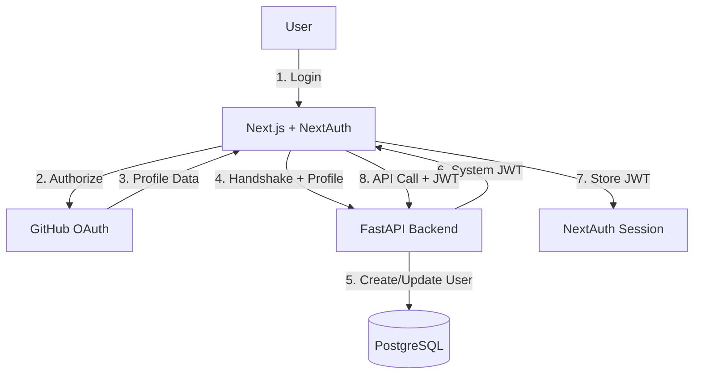

# 🔐 Authentication & Security

[← Back to Index](./README.md)

## Overview
Flashcard AI uses a **hybrid authentication flow** to bridge a modern Next.js frontend with a high-performance FastAPI backend:
- **NextAuth.js (v5)**: Orchestrates the GitHub OAuth handshake and manages frontend sessions.
- **FastAPI Auth Service**: Issues system-level JWT tokens and manages user state in the database.
- **Shared Secret Handshake**: A secure "trust" mechanism between the frontend and backend.

## 🏗️ Architecture

## 🔄 Authentication Flow

### 1. OAuth Handshake
- The user initiates login via `signIn("github")`.
- GitHub redirects to the app callback: `/api/auth/callback/github`.

### 2. Backend Exchange (`frontend/src/auth.ts`)
Inside the NextAuth `signIn` callback, the frontend performs a **GitHub Exchange**:
- **Endpoint**: `POST /api/auth/github-exchange`
- **Payload**: Includes email, github_id, username, avatar_url, and the `INTERNAL_AUTH_SECRET`.
- **Purpose**: This secret allows the backend to trust that the user data is verified by NextAuth.

### 3. JWT Issuance (`backend/app/api/auth.py`)
- The backend verifies the `INTERNAL_AUTH_SECRET`.
- It finds or creates the `User` in the database.
- It returns a JWT signed with the backend's `JWT_SECRET`.
- The frontend stores this token in the NextAuth `jwt` and `session` objects.

### 4. API Authorization (`frontend/src/lib/api.ts`)
- An Axios interceptor pulls the `backendToken` from the session.
- It adds the `Authorization: Bearer <TOKEN>` header to every outgoing request.

## 🛡️ Security Configuration

### Environment Variables

| Variable | Location | Description |
| :--- | :--- | :--- |
| `JWT_SECRET` | Backend | Used to sign and verify system JWTs. |
| `INTERNAL_AUTH_SECRET` | Both | Shared secret for the NextAuth-to-FastAPI handshake. |
| `AUTH_SECRET` | Frontend | Used by NextAuth to encrypt session cookies. |
| `AUTH_GITHUB_ID` | Frontend | GitHub OAuth Client ID. |
| `AUTH_GITHUB_SECRET` | Frontend | GitHub OAuth Client Secret. |

### Resource Isolation
All API endpoints use the `get_current_user` dependency to:
1. Verify the JWT.
2. Inject the `current_user` object into the request.
3. Filter database queries to ensure users only access their own decks and cards.

## 🚀 Future Improvements (Per PRD)
- **Direct Verification**: Transition to having the backend independently verify GitHub Access Tokens via GitHub's API, removing the need for the shared `INTERNAL_AUTH_SECRET`.
- **Token Refresh**: Implement JWT refresh logic for longer-lived sessions.

---
[← Back to Index](./README.md)
